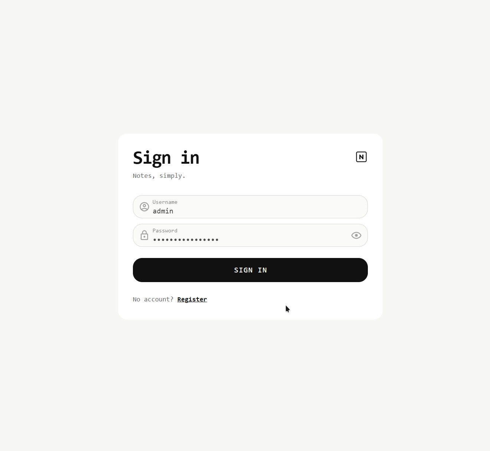

<!-- markdownlint-disable MD033 -->
<!-- markdownlint-disable MD041 -->

  <h2 align="center">💡 YaNotes</h2>

  

    Yet another note-taking app built to showcase a full-stack workflow with a
    Vue.js web client, Django REST API, secure authentication, automated tests,
    and a containerized runtime.
  

  

[][license]
[][github-pre-commit]
[][github-commitizen]
[][ruff]
[][pre-commit.ci]

  

  

  

## 🎉 Features

- Complete notes workspace with create, edit, copy, delete, search, sorting,
  and infinite scrolling
- Smooth account flow with registration, login, logout, protected routes,
  and restored user sessions
- Secure JWT authentication with short-lived access tokens and rotating
  HttpOnly refresh cookies
- Owner-aware access control that keeps personal notes private and gives
  administrators cross-owner tools
- Test suites covering authentication, notes workflows, routing,
  state management, composables, and shared client utilities
- CI pipeline for pre-commit checks, test suites, and Docker image builds
- Containerized app stack with Traefik in front of the web client, API,
  PostgreSQL database, and Redis cache

## 🛠️ Tech Stack

<!-- markdownlint-disable MD013 -->

[][editorconfig]
[][markdown]
[][python]
[][uv]
[][npm]
[][typescript]
[][django]
[][drf]
[][openapi]
[][postgresql]
[][redis]
[][vue]
[][vue-router]
[][pinia]
[][vueuse]
[][vuetify]
[][vee-validate]
[][axios]
[][zod]
[][sass]
[][vite]
[][pytest]
[][vitest]
[][ruff]
[][eslint]
[][github-pre-commit]
[][docker]
[][traefik]
[][github-actions]

## ✍️ Contributing

*First off, thanks for taking the time to contribute!*

Contributions are what make the open source community such an amazing place to learn, inspire, and create. Any contributions you make are **greatly appreciated**.

1. Fork the *Project*
2. Create your *Feature Branch* (`git checkout -b feature/awesome-feature`)
3. Commit your *Changes* (`git commit -m 'Add awesome feature'`)
4. Push to the *Branch* (`git push origin feature/awesome-feature`)
5. Open a *Pull Request*

## 💖 Like this project?

Leave a star if you think this project is cool or useful for you.

## ⚠️ License

`yanotes` is licensed under the MIT License. See the [LICENSE](LICENSE) for more information.

<!-- markdownlint-disable MD013 -->
<!-- Links -->
[axios]: https://axios-http.com/
[django]: https://www.djangoproject.com/
[docker]: https://www.docker.com/
[drf]: https://www.django-rest-framework.org/
[editorconfig]: https://editorconfig.org/
[eslint]: https://eslint.org/
[github-actions]: https://docs.github.com/en/actions
[github-commitizen]: https://github.com/commitizen/cz-cli
[github-pre-commit]: https://github.com/pre-commit/pre-commit
[license]: LICENSE
[markdown]: https://www.markdownguide.org/
[npm]: https://www.npmjs.com/
[openapi]: https://www.openapis.org/
[pinia]: https://pinia.vuejs.org/
[postgresql]: https://www.postgresql.org/
[pytest]: https://docs.pytest.org/
[python]: https://www.python.org/
[redis]: https://redis.io/
[ruff]: https://docs.astral.sh/ruff/
[sass]: https://sass-lang.com/
[traefik]: https://traefik.io/traefik/
[typescript]: https://www.typescriptlang.org/
[uv]: https://docs.astral.sh/uv/
[vee-validate]: https://vee-validate.logaretm.com/
[vite]: https://vite.dev/
[vitest]: https://vitest.dev/
[vue]: https://vuejs.org/
[vue-router]: https://router.vuejs.org/
[vueuse]: https://vueuse.org/
[vuetify]: https://vuetifyjs.com/
[zod]: https://zod.dev/
[pre-commit.ci]: https://results.pre-commit.ci/run/github/534330844/1777473893.CfweoDqrT6CC6A4PWs72EA
